# Diagrama Entidade-Relacionamento — Afiliados do Pollen Parque

Reflete o schema implementado em `back/src/migrations/`: 12 migrations do
schema inicial (20260915000001 a 20260915000012, ver
[`../decisoes/0004-modelagem-banco-afiliados.md`](../decisoes/0004-modelagem-banco-afiliados.md))
mais 12 migrations incrementais (20260915020001 a 20260915020012, ver
[`../decisoes/0005-mapeamento-planilha-legado.md`](../decisoes/0005-mapeamento-planilha-legado.md))
que cobriram lacunas encontradas ao comparar com a planilha de controle
legado da equipe. Decisões de modelagem (UUID seletivo, ENUM vs. tabela de
referência, cálculo on-the-fly, scope nomeado) estão nos dois ADRs acima.
Contrato de dados completo de cada tabela: arquivos `<entidade>.md` nesta
mesma pasta.

```mermaid
erDiagram
    EMPRESAS {
        uuid id PK
        string razao_social
        string cnpj UK "nullable"
        string identificador_estrangeiro "nullable"
        enum tipo_empresa
        enum tipo_caso_especial
        string status_processo "texto livre legado, mantido (RN-06)"
        integer status_processo_id FK "nullable, ADR 0005 4"
        string telefone "nullable"
        string cidade "nullable"
        string uf "nullable"
        string representante_legal "nullable"
    }

    USUARIOS {
        bigint id PK
        string email UK
        enum papel
        uuid empresa_id FK "nullable"
    }

    FORMULARIO_RESPOSTAS {
        bigint id PK
        uuid empresa_id FK "nullable"
        jsonb payload_respostas
        string status_triagem
    }

    ESPACOS_FISICOS {
        bigint id PK
        uuid empresa_id FK
        string identificador_sala
        date data_inicio_ocupacao
        date data_fim_ocupacao "nullable"
    }

    CONTRATOS {
        uuid id PK
        uuid empresa_id FK
        uuid contrato_anterior_id FK "nullable, self-relation"
        integer status_contrato_id FK
        bigint plano_id FK "nullable, ADR 0005 1"
        date data_inicio_vigencia
        date data_termino_vigencia
        string numero_chamado_procuradoria "nullable"
        boolean isento_taxa "default false, RN-34"
        text motivo_isencao "nullable"
        string documento_referencia "nullable"
    }

    PLANOS_AFILIACAO {
        bigint id PK
        string nome UK
        decimal valor
        boolean ativo
    }

    STATUS_CONTRATO {
        integer id PK
        string codigo UK
    }

    ASSINATURAS {
        bigint id PK
        uuid contrato_id FK
        enum papel_assinatura
        enum status
    }

    DOCUMENTOS {
        bigint id PK
        uuid empresa_id FK
        uuid contrato_id FK "nullable"
        enum tipo_documento
        enum status
    }

    FINANCEIRO_LANCAMENTOS {
        bigint id PK
        uuid empresa_id FK
        uuid contrato_id FK "nullable"
        integer status_financeiro_id FK
        date data_vencimento
        date data_pagamento "nullable"
        enum forma_pagamento
    }

    STATUS_FINANCEIRO {
        integer id PK
        string codigo UK
    }

    COMUNICACOES_EMAIL {
        bigint id PK
        boolean gerado_por_ia
        bigint revisado_por_usuario_id FK "nullable"
        enum status
    }

    COMUNICACOES_DESTINATARIOS {
        bigint comunicacao_email_id PK,FK
        uuid empresa_id PK,FK
    }

    LOG_AUDITORIA {
        bigint id PK
        string entidade
        string entidade_id
        enum acao
        bigint usuario_id FK "nullable"
        jsonb dados_anteriores
        jsonb dados_novos
    }

    STATUS_PROCESSO {
        integer id PK
        string codigo UK
        integer ordem UK "1 a 8, ADR 0005 4"
    }

    BENEFICIOS_EXPOSICAO {
        bigint id PK
        uuid empresa_id FK,UK "1:1 com empresas"
        boolean telao_ativo
        boolean marca_site_ativo
    }

    RESERVAS_ESPACO {
        bigint id PK
        uuid empresa_id FK
        enum tipo_espaco "sala_atico | auditorio | coworking"
        date data_reserva "nullable"
        enum status
    }

    STATUS_PROSPECCAO {
        integer id PK
        string codigo UK
    }

    PROSPECCOES {
        uuid id PK
        string nome_empresa
        string email_contato "nullable"
        integer status_prospeccao_id FK
        bigint formulario_resposta_id FK "nullable"
    }

    EMPRESAS ||--o{ USUARIOS : "vincula (empresa_afiliada)"
    EMPRESAS ||--o{ FORMULARIO_RESPOSTAS : recebe
    EMPRESAS ||--o{ ESPACOS_FISICOS : "ocupa (legado, ADR 0004)"
    EMPRESAS ||--o{ CONTRATOS : assina
    EMPRESAS ||--o{ DOCUMENTOS : envia
    EMPRESAS ||--o{ FINANCEIRO_LANCAMENTOS : gera
    EMPRESAS ||--o{ COMUNICACOES_DESTINATARIOS : "é destinatária"
    EMPRESAS ||--o| BENEFICIOS_EXPOSICAO : tem
    EMPRESAS ||--o{ RESERVAS_ESPACO : reserva
    STATUS_PROCESSO ||--o{ EMPRESAS : classifica

    CONTRATOS ||--o{ ASSINATURAS : requer
    CONTRATOS ||--o{ DOCUMENTOS : "referencia (opcional)"
    CONTRATOS ||--o{ FINANCEIRO_LANCAMENTOS : "referencia (opcional)"
    CONTRATOS ||--o{ CONTRATOS : "renova (contrato_anterior_id)"
    STATUS_CONTRATO ||--o{ CONTRATOS : classifica
    PLANOS_AFILIACAO ||--o{ CONTRATOS : "enquadra (opcional)"

    STATUS_FINANCEIRO ||--o{ FINANCEIRO_LANCAMENTOS : classifica

    USUARIOS ||--o{ COMUNICACOES_EMAIL : "revisa (opcional)"
    USUARIOS ||--o{ LOG_AUDITORIA : "registra (opcional)"

    COMUNICACOES_EMAIL ||--o{ COMUNICACOES_DESTINATARIOS : lista

    STATUS_PROSPECCAO ||--o{ PROSPECCOES : classifica
    FORMULARIO_RESPOSTAS ||--o| PROSPECCOES : "converte (opcional)"
```

## Notas de leitura

- **UUID seletivo**: apenas `empresas` e `contratos` usam `UUID`; as demais
  tabelas usam `BIGINT`/`INTEGER` autoincremento. Ver ADR 0004 §1.
- **`status_contrato` e `status_financeiro`** são tabelas de referência, não
  ENUM, para permitir novos estados via `INSERT` em vez de `ALTER TYPE`. Ver
  ADR 0004 §2.
- **`contrato_anterior_id`** é uma autorreferência de `contratos` para
  encadear renovações (RF-07). Ver ADR 0004 §5.
- **`comunicacoes_destinatarios`** é a tabela de junção N:N física entre
  `comunicacoes_email` e `empresas` (mapeada como `belongsToMany` com
  `through` explícito no Sequelize, não como M:N implícito).
- Os estados "renovação pendente" (RN-30) e "atrasado" (RN-31) **não
  aparecem como coluna** — são calculados em tempo de leitura a partir de
  `data_termino_vigencia` e `data_vencimento`/`data_pagamento`. Ver ADR 0004
  §3.
- **`empresas.status_processo` (texto livre) e `espacos_fisicos` não foram
  removidos** ao adicionar `status_processo_id`/`reservas_espaco` — ambos
  seguem intactos e sem uso em código novo, por decisão explícita do ADR
  0005 (nunca `DROP TABLE`/`DROP COLUMN` numa etapa com dado real já
  existente; remoção definitiva fica para uma tarefa futura, após validação
  manual).
- **`reservas_espaco` não é uma evolução de `espacos_fisicos`** — são
  conceitos diferentes: `espacos_fisicos` é a sala fixa que uma empresa
  ocupa continuamente; `reservas_espaco` é o uso pontual e limitado
  (RN-35) de um espaço compartilhado (ático, auditório, coworking). Ver
  ADR 0005 §6.
- **`prospeccoes`** representa a etapa anterior ao formulário de inscrição
  (RN-03/RN-36) — `formulario_resposta_id` só é preenchido quando/se a
  prospecção avança para o formulário; a maioria das prospecções nunca gera
  um `formulario_respostas`.
